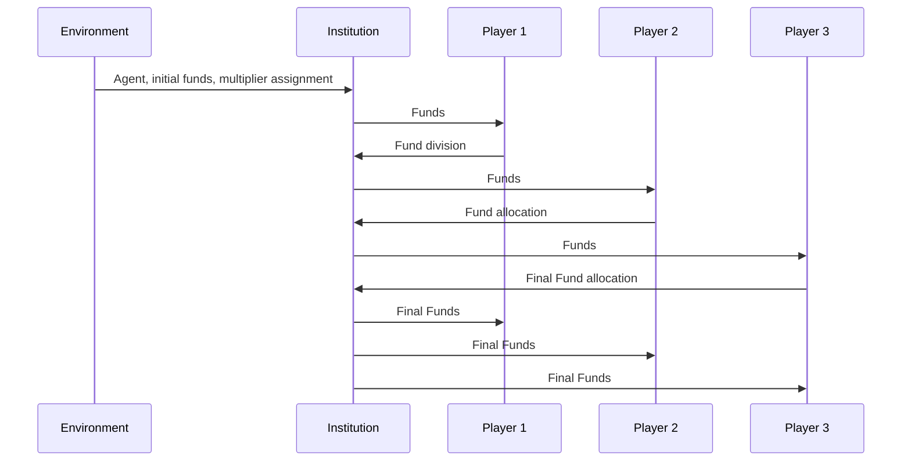

```mermaid
  sequenceDiagram
    Environment->>Institution: Agent, initial funds, multiplier assignment
    Institution->>Player 1: Funds
    Player 1->>Institution: Fund division
    Institution->>Player 2: Funds 
    Player 2->>Institution: Fund allocation
    Institution->>Player 3: Funds
    Player 3->>Institution: Final Fund allocation
    Institution->>Player 1: Final Funds 
    Institution->>Player 2: Final Funds
    Institution->>Player 3: Final Funds 
```